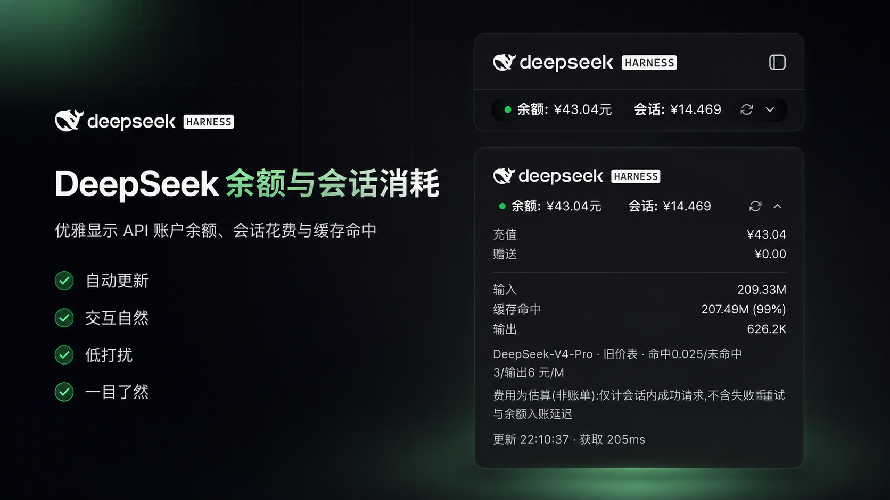
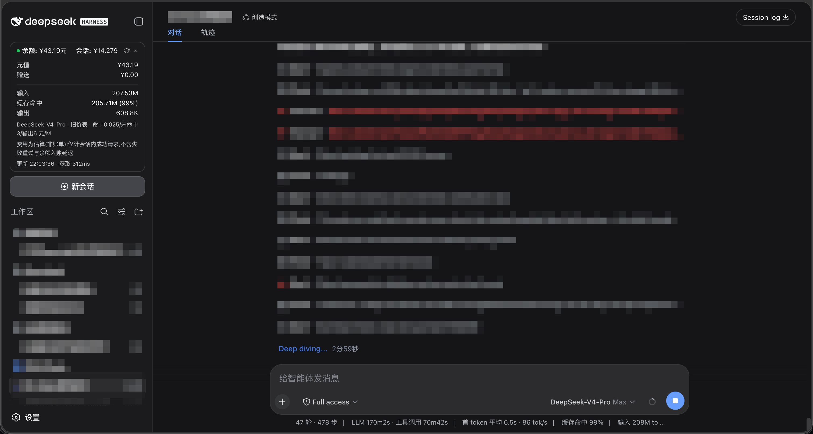
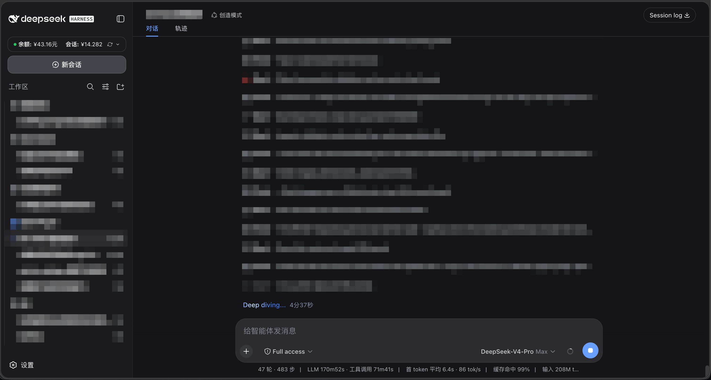

# dsh-deepseek-billing

[](https://awesome-dsh-plugin.com)

给 [DeepSeek Harness](https://github.com/deepseek-ai/deepseek-harness)(DSH)网页版装一个**余额小卡片**:在左侧边栏底部实时显示你的 DeepSeek **账户余额**,以及**当前会话花了多少钱**。

## 效果图



| 实际页面截图 1 | 实际页面截图 2 |
| --- | --- |
|  |  |

卡片长这样:

- **一行摘要**:绿点状态 · `余额:¥xx.xx元` · `会话:¥x.xxx` · 刷新按钮 · 箭头;
- **点一下展开**:显示充值/赠送余额、输入/输出 token、缓存命中率、本会话费用(标注“非账单”);
- 点卡片外面自动收起;数字变化时是滚动动画;切换会话自动跟着变;
- 侧边栏收起(窄栏)时自动隐藏,不挡东西;
- 每 60 秒自动刷新一次。

## 安装

### 方式一(最简):一条命令

```sh
dsh plugin --profile web add https://github.com/Jolly-J/dsh-deepseek-billing.git
```

装完重启 `dsh web` 即可(插件会自动作为 profile 层加入组合;`lib/` 产物已随仓库提交,无需本地构建)。

### 方式二:让 AI 帮你装

你不会装也没关系。**把本仓库地址发给你的 DSH 智能体**,对它说一句:

> 帮我把这个插件装到我的 DSH 里:<仓库地址>

智能体只需执行上面的官方 `dsh plugin add` 命令并提示你重启 `dsh web`;不需要修改 DSH 源码。

### 更新

```sh
dsh plugin --profile web update dsh-deepseek-billing
```

更新后重启 `dsh web`。

## 开发与维护

用户安装直接使用仓库内提交的 `lib/` 产物。`src/` 是唯一源码真源,根目录不保留源码或 bundle 副本。官方 DSH 的客户端 bundle 运行在 Vite 模块图之外,因此发布产物同时包含 `lib/client.js` 和 `lib/client.js.map`。

构建配置复用 DSH 官方的客户端插件预设,所以开发 checkout 必须位于 DSH monorepo 的扩展目录:

```sh
git clone https://github.com/deepseek-ai/deepseek-harness.git
git clone https://github.com/Jolly-J/dsh-deepseek-billing.git \
  deepseek-harness/packages/extensions/dsh-deepseek-billing
cd deepseek-harness
pnpm install
pnpm --filter dsh-deepseek-billing verify
```

`verify` 会依次执行类型构建、官方 client bundle、价格与用量单元测试,以及发布目录和页脚布局约定检查。GitHub Actions 使用同一条命令。

目录职责:

- `src/`:源码和可直接测试的计费模块;
- `lib/`:由 `npm run build` 生成并提交的安装产物;
- `tests/`:价格、用量和发布产物回归测试;
- `docs/images/`:README 与插件市场截图;
- `cordis.patch.yml`:让 `dsh plugin add` 自动挂载本插件的组合包声明。

## 数据从哪来

- **余额**:直接调用 DeepSeek 官方余额接口,用的就是你模型正在用的**同一把 API Key**,不用另外配置;
- **花了多少钱**:读取 DSH 自己记录的每次模型调用用量,按 DeepSeek **官方价格表**计算(含缓存命中和 2026-08-17 起的峰谷价),本会话累计。

## 密钥安全(重要,请花一分钟读)

插件**不存、不偷、不外传你的 API Key**:

- 它只是向 DSH 要"模型正在用的那把钥匙"(`DEEPSEEK_API_KEY`),临时拿来调一次官方余额接口,用完即弃;
- 密钥只短暂出现在本机插件进程内存里(以环境变量方式传给一次 `curl`,不出现在命令行参数中);
- **不会**写进磁盘/日志/缓存,**不会**出现在网页接口返回里,**不会**发给 DeepSeek 以外的地方;
- 仓库代码里没有任何密钥,只有环境变量的**名字** `DEEPSEEK_API_KEY`。

已知的两个通用风险(不是本插件独有):同机器的同权限进程理论上能读到 curl 进程的环境变量;局域网里能访问你 DSH 网页端口的人可以看到你的**余额数字**(看不到密钥)。介意的话请在部署层给 `/billing/status` 加访问限制。

## 费用准确性说明(与余额对账必读)

卡片上的“会话费用”是**估算值,不是账单**:官方刊例价 × 会话内**成功请求**的用量。以下三样是会话日志看不见、但余额会扣的:

1. **失败重试**:模型请求失败重试时,每次尝试的输入 token 都会被计费,但只有最终成功的那次会写进会话日志;
2. **后台模型调用**:会话标题生成、联网搜索的查询等不在会话 usage 里;
3. **余额异步入账**:DeepSeek 结算有延迟,余额读数可能滞后或提前包含窗口外的消费。

**作者实测对账案例**(7 分钟窗口):余额 -¥1.36,会话估算 +¥1.035,差 ¥0.325——正是上述不可见计费。**余额是唯一真值,卡片费用仅作归因参考。**

## 已知限制

- 费用只算**当前会话**,子代理会话暂未汇总;
- 价格表内置在代码里,官方调价后需要更新插件版本(官方没有价格查询接口);
- 文案目前是中文。

## License

[MIT](LICENSE)
