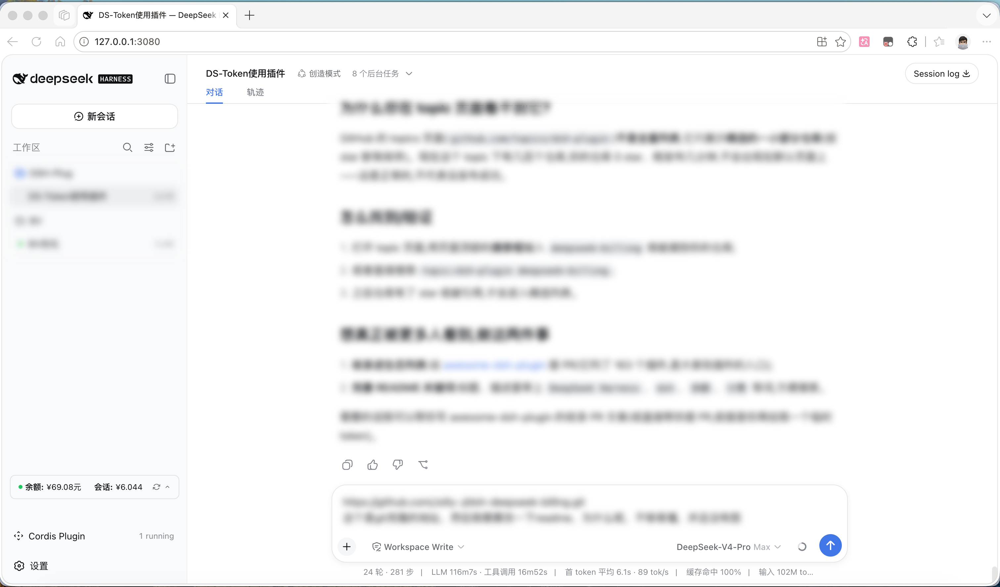
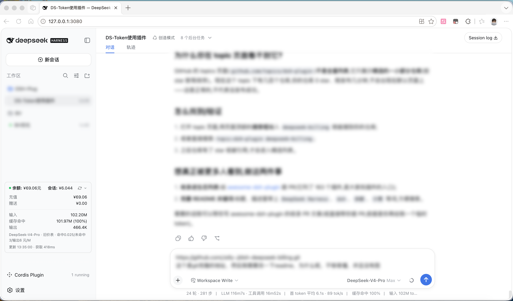

# dsh-deepseek-billing

给 [DeepSeek Harness](https://github.com/deepseek-ai/deepseek-harness)(DSH)网页版装一个**余额小卡片**:在左侧边栏底部实时显示你的 DeepSeek **账户余额**,以及**当前会话花了多少钱**。

## 效果图

| --- | --- |
|  |  |

卡片长这样:

- **一行摘要**:绿点状态 · `余额:¥xx.xx元` · `会话:¥x.xxx` · 刷新按钮 · 箭头;
- **点一下展开**:显示充值/赠送余额、输入/输出 token、缓存命中率、本会话费用;
- 点卡片外面自动收起;数字变化时是滚动动画;切换会话自动跟着变;
- 侧边栏收起(窄栏)时自动隐藏,不挡东西;
- 每 60 秒自动刷新一次。

## 安装(推荐:让 AI 帮你装)

你不会装也没关系。**把本仓库地址发给你的 DSH 智能体**,对它说一句:

> 帮我把这个插件装到我的 DSH 里:[<仓库地址>](https://github.com/Jolly-J/dsh-deepseek-billing)

你的智能体照着下面 6 步做完,重启 `dsh web` 就好了:

1. 把本仓库放到 DSH 项目的 `packages/extensions/dsh-deepseek-billing`;
2. 在 `packages/bundle/web-app/cordis.patch.yml` 里加一行:
   ```yaml
   - id: ui-deepseek-billing
     name: 'dsh-deepseek-billing'
   ```
3. 在 `packages/bundle/web-app/package.json` 的 `dependencies` 里加:
   ```json
   "dsh-deepseek-billing": "workspace:^"
   ```
4. 在根目录 `tsconfig.client.json` 的 `references` 里加 `{ "path": "./packages/extensions/dsh-deepseek-billing" }`;
5. 运行 `pnpm install`,然后构建:`pnpm --filter dsh-deepseek-billing bundle`;
6. 重启 `dsh web`。

> 要求:DSH 项目本身能正常构建,`pnpm` 版本 11.7.0(和 DSH 的 `packageManager` 一致)。

## 数据从哪来

- **余额**:直接调用 DeepSeek 官方余额接口,用的就是你模型正在用的**同一把 API Key**,不用另外配置;
- **花了多少钱**:读取 DSH 自己记录的每次模型调用用量,按 DeepSeek **官方价格表**计算(含缓存命中和 2026-08-17 起的峰谷价),本会话累计。

## 密钥安全(重要,请花一分钟读)

插件**不存、不偷、不外传你的 API Key**:

- 它只是向 DSH 要"模型正在用的那把钥匙"(`DEEPSEEK_API_KEY`),临时拿来调一次官方余额接口,用完即弃;
- 密钥只短暂出现在本机插件进程内存里(以环境变量方式传给一次 `curl`,不出现在命令行参数中);
- **不会**写进磁盘/日志/缓存,**不会**出现在网页接口返回里,**不会**发给 DeepSeek 以外的地方;
- 仓库代码里没有任何密钥,只有环境变量的**名字** `DEEPSEEK_API_KEY`。

已知的两个通用风险(不是本插件独有):同机器的同权限进程理论上能读到 curl 进程的环境变量;局域网里能访问你 DSH 网页端口的人可以看到你的**余额数字**(看不到密钥)。介意的话请在部署层给 `/billing/status` 加访问限制。

## 已知限制

- 费用只算**当前会话**,子代理会话暂未汇总;
- 价格表内置在代码里,官方调价后需要更新插件版本(官方没有价格查询接口);
- 文案目前是中文。

## License

[MIT](LICENSE)
